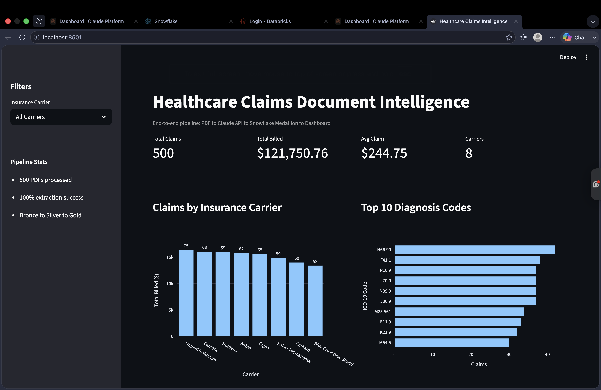

# Healthcare Claims Document Intelligence Pipeline

End-to-end data engineering pipeline that ingests unstructured healthcare claim PDFs, extracts structured data using Anthropic's Claude API, lands it in Snowflake using Medallion architecture (Bronze / Silver / Gold), and serves analytics through a Streamlit dashboard.





## Architecture

```
Synthetic PDFs (500 claims)
        |
        v
pdfplumber  (text extraction)
        |
        v
Claude API  (structured field extraction)
        |
        v
Pydantic validation  (schema enforcement)
        |
        v
Snowflake BRONZE  (raw JSON in VARIANT)
        |
        v
Snowflake SILVER  (typed columns + data quality + quarantine)
        |
        v
Snowflake GOLD  (carrier, diagnosis, provider, daily trend aggregations)
        |
        v
Streamlit Dashboard  (KPIs, filters, charts)
```

## Tech Stack

- Languages: Python 3.11, SQL
- LLM: Anthropic Claude API
- Cloud Data Warehouse: Snowflake (VARIANT, internal stages, PUT, COPY INTO)
- Data Modeling: Medallion Architecture (Bronze / Silver / Gold)
- Validation: Pydantic
- PDF Processing: pdfplumber, reportlab
- Visualization: Streamlit, Plotly
- Version Control: Git, GitHub

## Data Flow

### Bronze layer
- Raw JSON output from Claude API stored in BRONZE_CLAIMS_RAW table
- Schema: FILE_NAME STRING, RAW_JSON VARIANT, INGESTED_AT TIMESTAMP
- Audit trail for reprocessing if downstream logic changes

### Silver layer
- Flattened, typed columns extracted from JSON VARIANT
- Data quality validation: claim_id not null, claim_amount > 0, valid dates
- Failed rows routed to SILVER_CLAIMS_QUARANTINE with rejection reason
- Lineage columns: source file, bronze ingestion timestamp, silver processed timestamp

### Gold layer
Four aggregation tables for dashboard consumption:
- GOLD_CLAIMS_BY_CARRIER - claims and total billed by insurance carrier
- GOLD_CLAIMS_BY_DIAGNOSIS - claims by ICD-10 code with description
- GOLD_CLAIMS_BY_PROVIDER - provider-level claim rollup
- GOLD_DAILY_CLAIMS_TREND - daily time-series of claim count and total amount

## Pipeline Stats

- 500 PDFs generated
- 500 PDFs successfully extracted (100% extraction success)
- 500 rows landed in Bronze
- 500 rows in Silver after validation, 0 in quarantine
- 4 Gold tables built
- Approximately one dollar total Claude API spend

## Project Structure

```
doc-intelligence-pipeline/
  src/
    pdf_generator.py
    claude_extractor.py
    snowflake_loader.py
    streamlit_app.py
  data/
    raw_pdfs/
    extracted_json/
  notebooks/
  monitoring/
  requirements.txt
  README.md
```

## Setup

Prerequisites: Python 3.11, Snowflake account, Anthropic API key

Install:
```
git clone https://github.com/sowmyad-de/doc-intelligence-pipeline.git
cd doc-intelligence-pipeline
python -m venv venv
source venv/bin/activate
pip install -r requirements.txt
```

Create a .env file at project root with your credentials.

Run the pipeline:
```
python src/pdf_generator.py
python src/claude_extractor.py
python src/snowflake_loader.py
streamlit run src/streamlit_app.py
```

## Data Quality Approach

The pipeline applies four validation rules at the Silver layer:
- claim_id must be present and non-empty
- claim_amount must be numeric and greater than zero
- service_date must be parseable as a date
- patient_dob must be parseable as a date

Rows failing any rule are routed to a quarantine table with a labeled rejection reason. This keeps the Silver layer clean while preserving audit trail for reprocessing.

## Notes on Synthetic Data

The 500 claims were generated by Claude API with structured prompts producing realistic field values (8 major US insurance carriers, valid ICD-10 codes, NPI-format provider IDs, realistic claim amounts). Unique providers per claim is a known limitation of LLM-based synthetic data.

## Author

Sowmya D - Senior Data Engineer
GitHub: github.com/sowmyad-de